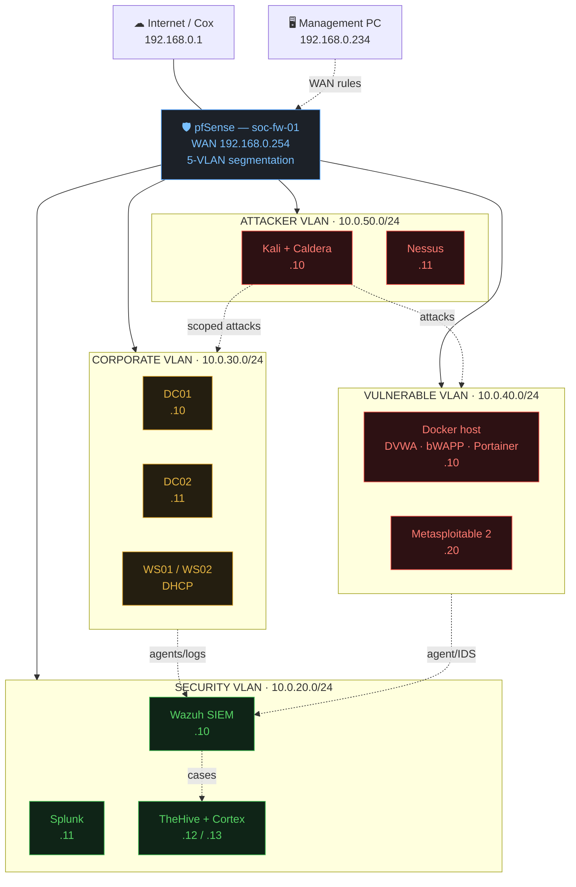

```mermaid
flowchart TB
    NET["☁ Internet / Cox<br/>192.168.0.1"]
    MGMT["🖥 Management PC<br/>192.168.0.234"]

    NET --- FW
    MGMT -.WAN rules.-> FW

    FW["🛡 pfSense — soc-fw-01<br/>WAN 192.168.0.254<br/>5-VLAN segmentation"]

    subgraph SEC["SECURITY VLAN · 10.0.20.0/24"]
        WAZUH["Wazuh SIEM<br/>.10"]
        SPLUNK["Splunk<br/>.11"]
        HIVE["TheHive + Cortex<br/>.12 / .13"]
    end

    subgraph CORP["CORPORATE VLAN · 10.0.30.0/24"]
        DC1["DC01<br/>.10"]
        DC2["DC02<br/>.11"]
        WS["WS01 / WS02<br/>DHCP"]
    end

    subgraph VULN["VULNERABLE VLAN · 10.0.40.0/24"]
        DOCKER["Docker host<br/>DVWA · bWAPP · Portainer<br/>.10"]
        MSF["Metasploitable 2<br/>.20"]
    end

    subgraph ATK["ATTACKER VLAN · 10.0.50.0/24"]
        KALI["Kali + Caldera<br/>.10"]
        NESSUS["Nessus<br/>.11"]
    end

    FW --> SEC
    FW --> CORP
    FW --> VULN
    FW --> ATK

    KALI -.attacks.-> VULN
    KALI -.scoped attacks.-> CORP
    CORP -.agents/logs.-> WAZUH
    VULN -.agent/IDS.-> WAZUH
    WAZUH -.cases.-> HIVE

    classDef sec fill:#0f2417,stroke:#3fb950,color:#56d364
    classDef corp fill:#241e10,stroke:#d29922,color:#e3b341
    classDef vuln fill:#2d1113,stroke:#f85149,color:#ff7b72
    classDef atk fill:#2d1113,stroke:#f85149,color:#ff7b72
    classDef fw fill:#1c2128,stroke:#58a6ff,color:#79c0ff

    class WAZUH,SPLUNK,HIVE sec
    class DC1,DC2,WS corp
    class DOCKER,MSF vuln
    class KALI,NESSUS atk
    class FW fw
```

